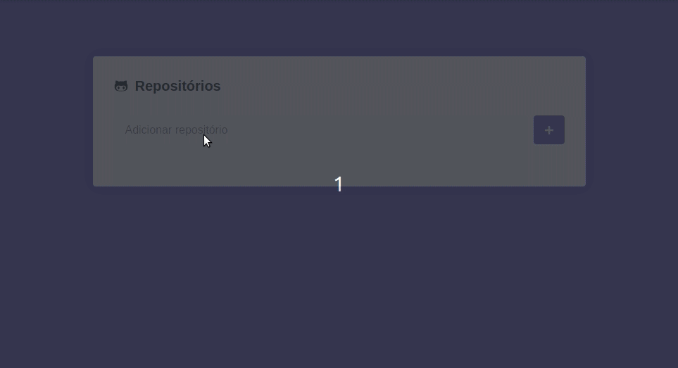

# Github API - React JS

ReactJS application that uses the github API to track repositories and their issues

# Setup

### Installation

- run `npm install` or `yarn install`

### Run on Device

- run `yarn start` / `npm run start` to run the application

#### View - Web App

 
